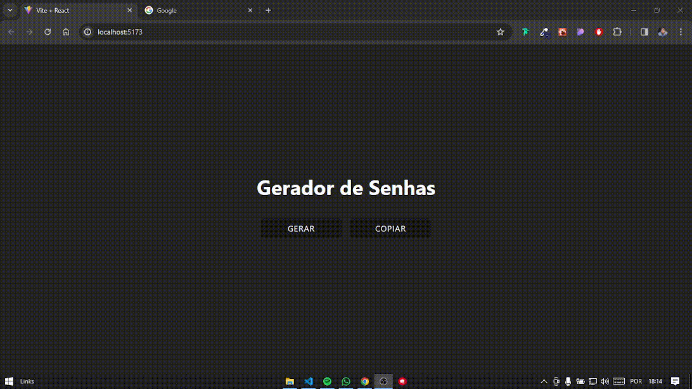

# Gerador de Senhas com React JS

Como o próprio nome do projeto sugere, ele gera senhas. Mais especificamente com 12 dígitos, letras maiúsculas e minúsculas, além de caracteres especiais.

O intuito do projeto é mais treinar React e praticar alguns conceitos de componentes, eventos e hooks no React.

## Demonstração

